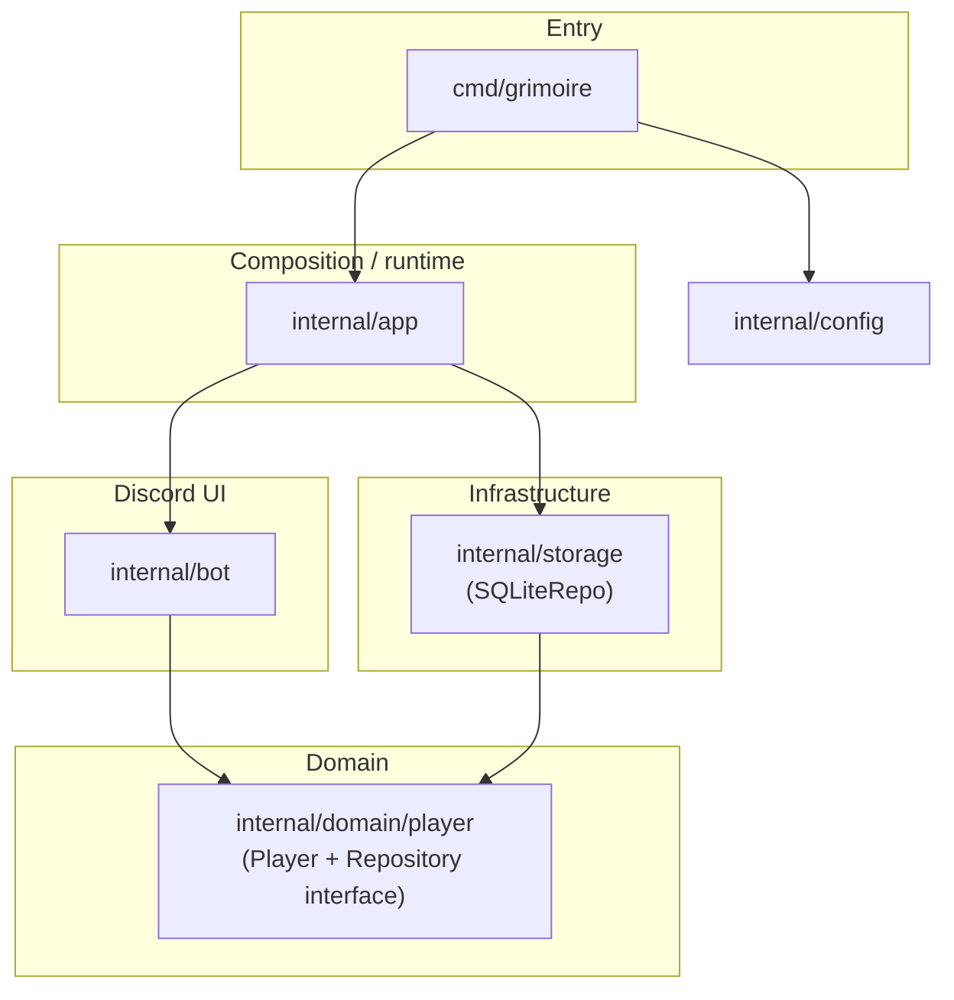

# Architecture

Grimoire is a Discord bot that shows a shared “adventure stats” panel (critical hits, damage, healing, falls, deaths, custom notes). This document explains how the Go packages fit together.

## What runs where

1. **`cmd/grimoire`** — Loads environment/config, sets up signal-based shutdown (`SIGINT` / `SIGTERM`), and calls `app.Run`.
2. **`internal/app`** — Wires everything: opens the Discord session, opens SQLite, wraps the DB with `LoggingPlayerRepository`, loads players, builds `GrimoireBot`, registers slash command and interaction handlers, blocks until the context is cancelled.
3. **`internal/bot`** — Discord-only logic: slash `/grimoire`, buttons, select menu, modals, rendering the ANSI table. It depends on **`player.Repository`** (interface), not on SQLite directly.
4. **`internal/domain/player`** — The **`Player`** aggregate (stats + name) and the **`Repository`** port (save/load). No Discord imports.
5. **`internal/storage`** — **`SQLiteRepo`** implements **`player.Repository`**: creates the `players` table if needed, upserts rows, loads by name list.
6. **`internal/config`** — Reads `DISCORD_TOKEN`, optional `GRIMOIRE_DB_PATH`, optional comma-separated `GRIMOIRE_PLAYERS`, and walks upward from the working directory to find a `.env` file.

## Repository wiring (important)

At startup, `app` does **not** pass `SQLiteRepo` straight into the bot. It wraps it:

```text
SQLiteRepo  →  LoggingPlayerRepository{Inner: sqliteRepo}  →  GrimoireBot.Repo
```

`LoggingPlayerRepository` implements the same **`player.Repository`** interface; it forwards calls to `SQLiteRepo` and logs duration and errors. So “bot talks to domain interface; concrete DB + logging are composed in `app`.”

## Package dependency diagram



- **`app`** imports **`bot`** and **`storage`** and connects them.
- **`bot`** and **`storage`** both import **`domain/player`**; they do not import each other.

## Interaction flow (user → persistence)

1. **Slash `/grimoire`** — Bot replies with a message: table content + action rows (player select, stat buttons, modals).
2. **Message components** (select / buttons) — Handler locks a mutex, maps the **panel message ID** to the **selected player** (`activeByMsg`). If no player is selected yet, some actions reply with an ephemeral error. Updates that change stats call **`Repo.SavePlayer`** then **`InteractionResponseUpdateMessage`** to refresh the table on the same message.
3. **Modal submit** — `CustomID` is prefixed (`modal_data:` or `modal_custom:`) plus the message ID so the handler can find which panel and which focused player to update; then save and update the message.

`app` also logs each interaction type (command / component / modal) with `slog` (`logDiscordInteraction`), using public Discord IDs only—no secrets in logs.

## SQLite schema (summary)

Table **`players`**: primary key **`name`**, integer columns for nat20, nat1, damage totals/max, healing totals/max, falls, deaths, and **`custom`** text.

## Main dependencies

| Module | Role |
|--------|------|
| `github.com/bwmarrin/discordgo` | Discord API and gateway |
| `modernc.org/sqlite` | SQLite driver (pure Go, no CGO) |
| `github.com/joho/godotenv` | Optional `.env` loading |
